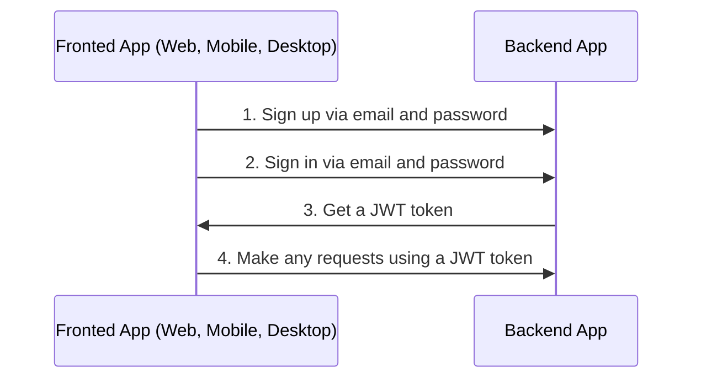

# Auth

## Table of Contents

- [General info](#general-info)
- [Configure Auth](#configure-auth)

---

## General info

This app uses sign in and sign up via email and password.



1. Make any requests using a JWT token

---

## Configure Auth

1. Generate secret key

    ```bash
    node -e "console.log(require('crypto').randomBytes(256).toString('base64'));"
    ```

1. Go to `/.env` and change value in `AUTH_JWT_SECRET`

    ```text
    AUTH_JWT_SECRET=HERE_SECRET_KEY_FROM_STEP_1
    ```

---

Previous: [Working with database](database.md)

Next: [Serialization](serialization.md)
